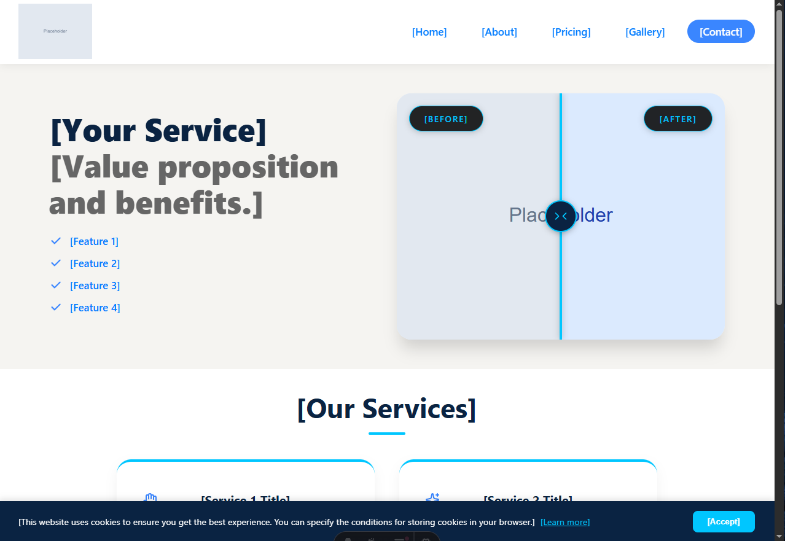

<div align="center">

# Astro Business Starter & CMS

**[Live Demo](https://astro-business-starter.pages.dev/)**

<br />


<br />



</div>

## About

A high-performance, minimalist Astro template tailored for local service businesses. Uses a zero-JS architecture by default and completely separates data from UI with JSON files. Designed for maximum speed, easy content management, and straightforward deployment on Cloudflare Pages.

## Features

- **Integrated Headless CMS** — Built-in `/admin` panel (Static CMS) that commits changes directly via the GitHub API. No separate backend needed.
- **Data-Driven UI** — All business content (services, pricing, gallery, contact, about) is decoupled from UI and managed through JSON files in `/src/data/`.
- **Before & After Slider** — Custom vanilla JS image comparison slider with zero external dependencies.
- **Mobile-First & Responsive** — Clean vanilla CSS architecture adapted for all screen sizes.
- **SEO Optimized** — Dynamic meta tags per page, auto-generated XML sitemap, and `robots.txt`.
- **Markdown Support** — Rich text content (e.g. biographies) rendered via the `marked` library.
- **Google Maps Ready** — Location embedding support built into the contact page.

## Tech Stack

| Layer | Technology |
|---|---|
| Framework | Astro |
| Language | TypeScript |
| Styling | CSS3 |
| CMS | Static CMS (GitHub backend) |
| Content storage | JSON |
| Icons | lucide-astro |
| Hosting | Cloudflare Pages |

## Project Structure

```
/
├── public/
│   ├── admin/
│   └── robots.txt
├── src/
│   ├── assets/
│   │   └── uploads/
│   ├── components/
│   │   ├── Header.astro
│   │   ├── Footer.astro
│   │   ├── HeroSection.astro
│   │   ├── ServicesSection.astro
│   │   ├── ShowcaseSlider.astro
│   │   └── CookieBanner.astro
│   ├── data/
│   │   ├── services.json
│   │   ├── pricing.json
│   │   ├── gallery.json
│   │   ├── about.json
│   │   └── contact.json
│   ├── layouts/
│   │   └── Layout.astro
│   └── pages/
│       ├── index.astro
│       ├── about.astro
│       ├── contact.astro
│       ├── gallery.astro
│       ├── pricing.astro
│       └── privacy-policy.astro
├── functions/
├── astro.config.mjs
└── tsconfig.json
```

## Getting Started

### Prerequisites

- Node.js 18+
- A GitHub account (for CMS backend)

### Installation

```bash
git clone https://github.com/your-username/astro-business-starter.git
cd astro-business-starter
npm install
npm run dev
```

### Available Scripts

| Command | Action |
|---|---|
| `npm run dev` | Start local dev server at `localhost:4321` |
| `npm run build` | Build production site to `./dist/` |
| `npm run preview` | Preview the production build locally |
